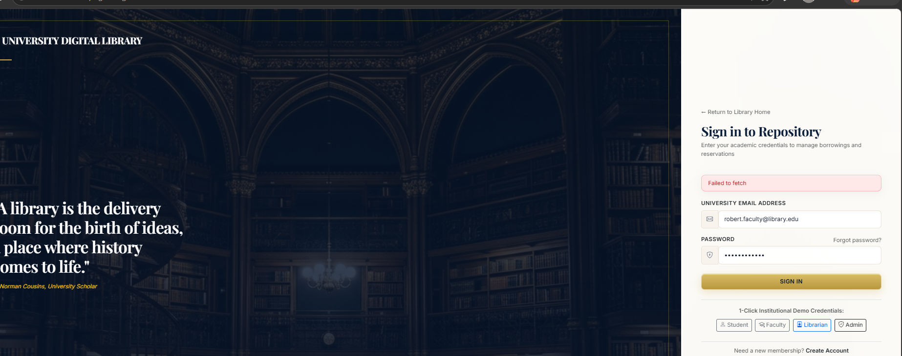
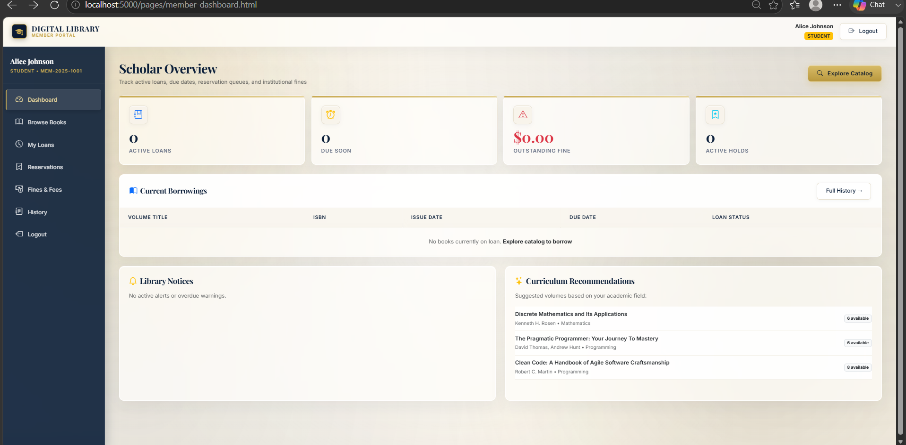
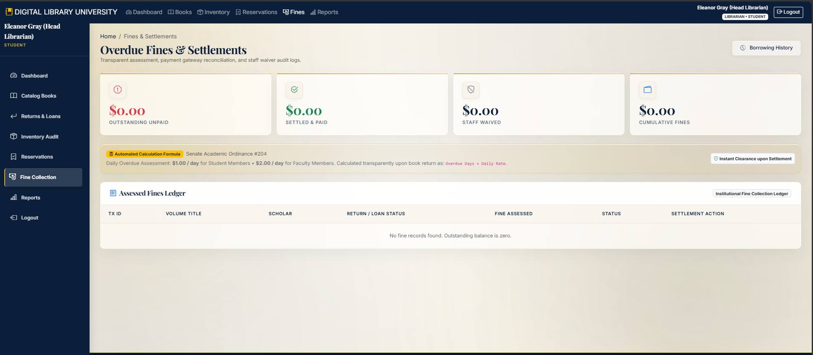

# University Digital Library Management System

A full-stack digital library platform for university students, faculty, librarians, and administrators. The system provides secure authentication, academic catalog browsing, borrowing workflows, reservations, fines, inventory tracking, and operational reporting through role-specific interfaces.

## Screenshots

### Landing page

The public landing page introduces the digital library, highlights academic subject areas, and provides catalog search and member sign-in actions.


### Login page

The split-screen authentication page supports university credentials and includes quick demo-role access for evaluation.



### Student dashboard

Students can view active loans, due dates, fines, holds, current borrowings, library notices, and curriculum recommendations.



### Administrator view

Administrative users can monitor fine collection, settlements, waivers, and the institutional fine ledger.



## Core features

- Role-based access for students, faculty, librarians, and administrators.
- JWT authentication with bcrypt password hashing.
- Academic catalog search, filtering, book details, and availability tracking.
- Borrowing, returns, renewals, reservation queues, and borrowing history.
- Automated overdue-fine calculation with configurable rates and maximums.
- Inventory audit logs and administrative reports.
- Request validation, centralized error handling, security headers, CORS, and rate limiting.
- MongoDB support with an optional embedded in-memory database for development and tests.
- Postman collection for API testing and an automated backend test suite.

## Technology stack

| Layer | Technologies |
| --- | --- |
| Frontend | HTML, CSS, Bootstrap, vanilla JavaScript |
| Backend | Node.js, Express.js |
| Database | MongoDB, Mongoose |
| Authentication | JWT, bcryptjs |
| Validation and security | Joi, Helmet, CORS, express-rate-limit |
| Testing | Node.js test runner, MongoDB Memory Server |

## Project structure

```text
.
├── backend/
│   ├── config/          Database and environment configuration
│   ├── controllers/     Request handlers
│   ├── middleware/      Authentication, roles, validation, and errors
│   ├── models/          Mongoose schemas
│   ├── routes/          REST API routes
│   ├── seed/            Demo data seed scripts
│   ├── services/        Business logic
│   └── tests/           Automated tests
├── frontend/
│   ├── pages/            Public, member, librarian, and admin pages
│   ├── css/              Shared design system
│   ├── js/               API calls and page interactions
│   └── assets/           Images and frontend assets
├── docs/screenshots/     Selected product screenshots
└── postman/              API collection
```

## Requirements

- Node.js 18 or newer
- npm
- MongoDB, or the included in-memory database mode for development

## Installation

```bash
git clone <repository-url>
cd "Library Lt"
npm install
```

Create a local environment file:

```bash
copy .env.example .env
```

On macOS/Linux, use `cp .env.example .env` instead. The default `.env.example` configuration enables the in-memory database, so a local MongoDB installation is not required for a basic demo.

## Run the application

Start the server:

```bash
npm start
```

For development with automatic restart:

```bash
npm run dev
```

Open [http://localhost:5000](http://localhost:5000) in a browser.

## Useful commands

```bash
npm run seed    # Seed books, users, memberships, and demo data
npm test        # Run the backend test suite
```

## Environment variables

The main configuration values are documented in `.env.example`:

| Variable | Purpose |
| --- | --- |
| `PORT` | HTTP server port, usually `5000` |
| `MONGODB_URI` | MongoDB connection string |
| `USE_MEMORY_DB` | Use embedded MongoDB when set to `true` |
| `JWT_SECRET` | Secret used to sign authentication tokens |
| `JWT_EXPIRES_IN` | Token lifetime |
| `FINE_DEFAULT_RATE` | Default overdue fine rate |
| `MAX_FINE_AMOUNT` | Maximum fine amount |
| `HOLD_EXPIRY_DAYS` | Reservation hold expiry period |

Change `JWT_SECRET` before using the application outside local development.

## API and testing

The REST API is served from the same Express application. The ready-to-import Postman collection is available at [`postman/Digital-Library-Management-System.postman_collection.json`](postman/Digital-Library-Management-System.postman_collection.json).

Run the automated tests with:

```bash
npm test
```

## License

This project is released under the MIT License.
