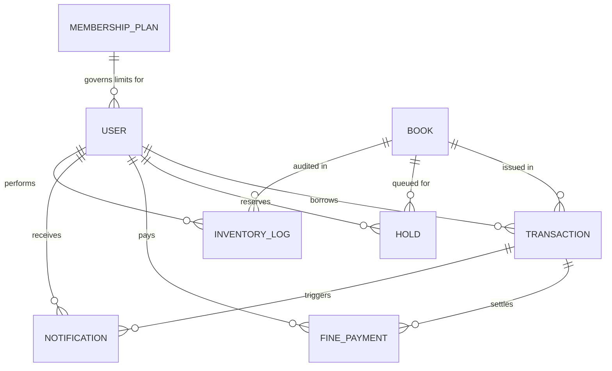

# University Digital Library Management System (DLMS)

[](https://nodejs.org/)
[](https://expressjs.com/)
[](https://mongoosejs.com/)
[](https://jwt.io/)
[](LICENSE)

An enterprise-grade, academic-compliant **Digital Library Management System (DLMS)** engineered for university libraries. DLMS replaces legacy manual paper registers with an automated, role-governed digital circulation platform.

The system features an MVC plus Service layer architecture, fine-grained Role-Based Access Control (RBAC), server-side request validation (Joi), centralized error handling, an automated FIFO reservation hold queue, overdue fine calculation engine, immutable inventory audit logging, comprehensive institutional reporting, an automated test suite, and a sophisticated academic frontend.

---

## Table of Contents
1. [Problem Statement](#1-problem-statement)
2. [Objectives](#2-objectives)
3. [Key Features](#3-key-features)
4. [Technology Stack](#4-technology-stack)
5. [Architecture & Design Pattern](#5-architecture--design-pattern)
6. [Folder Structure](#6-folder-structure)
7. [Database Schema & Collections](#7-database-schema--collections)
8. [Database Relationship (ER) Diagram](#8-database-relationship-er-diagram)
9. [Reasoning for References vs Embedding](#9-reasoning-for-references-vs-embedding)
10. [REST API Documentation](#10-rest-api-documentation)
11. [Authentication Flow](#11-authentication-flow)
12. [Role-Based Access Control (RBAC) Matrix](#12-role-based-access-control-rbac-matrix)
13. [Business Rules Enforced](#13-business-rules-enforced)
14. [Design System & Aesthetics](#14-design-system--aesthetics)
15. [Installation & Setup](#15-installation--setup)
16. [Environment Configuration](#16-environment-configuration)
17. [Database Seeding](#17-database-seeding)
18. [Automated Testing](#18-automated-testing)
19. [Postman Collection Guide](#19-postman-collection-guide)
20. [End-to-End Demo Walkthrough](#20-end-to-end-demo-walkthrough)
21. [Known Limitations](#21-known-limitations)
22. [License & Team](#22-license--team)

---

## 1. Problem Statement
University campus libraries historically handled circulation, renewals, and fine assessments through paper ledgers and fragmented records. This manual approach caused:
- Discrepancies between physical shelf stock and ledger book records.
- Inability to prevent scholars from exceeding borrowing quotas or checking out duplicate copies.
- Human error and inconsistencies in calculating daily overdue fines.
- Inefficient reservation procedures when high-demand course texts were out of stock.
- Lack of institutional analytics regarding curriculum usage and collection depreciation.

## 2. Objectives
1. Provide zero-loss inventory tracking with strict copy consistency (`total = available + issued + lost + damaged`).
2. Enforce strict membership borrowing limits and loan durations based on university senate plans (Student vs Faculty).
3. Automate due-date generation and mathematical overdue fine assessment upon return.
4. Establish an automated FIFO reservation hold queue that notifies scholars the moment returned copies enter circulation.
5. Provide transparent fine ledgers supporting mock academic settlements and administrative waivers.
6. Deliver an Ivy-League academic design aesthetic tailored for scholars, librarians, and administrators.

---

## 3. Key Features
- **13 Complete Functional Modules**: Full backend logic, validation, persistence, and UI for Authentication, Books, Search, Issue, Return, Holds, Membership Plans, Fines, Notifications, Inventory, History, Reporting, and RBAC.
- **Dual-Mode Database Connector**: Seamlessly connects to MongoDB or launches an embedded in-memory MongoDB runner out-of-the-box if no local daemon is installed.
- **Automated Fine Formula**: $\text{overdueDays} = \max(0, \lfloor(\text{returnDate} - \text{dueDate}) / 1\text{ day}\rfloor)$; $\text{fine} = \min(\text{overdueDays} \times \text{rate}, \text{maxFine})$.
- **FIFO Reservation Engine**: Books out of stock queue waiting members in priority order and trigger automated notifications upon return.
- **Split-Screen Authentication**: Academic hero branding alongside 1-click evaluation credentials for all institutional roles.
- **Complete Test Coverage**: Automated test suites covering all business edge cases.

---

## 4. Technology Stack

| Layer | Technology | Description |
| :--- | :--- | :--- |
| **Runtime** | Node.js (v24 LTS) | High-performance asynchronous JavaScript engine |
| **Backend Framework** | Express.js (v4.21) | RESTful API routing, middleware chaining, and static file serving |
| **Database** | MongoDB & Mongoose (v8.6) | Document persistence, schema validation, and aggregation pipelines |
| **Security** | Helmet, CORS, Rate-Limiting | HTTP security headers and endpoint brute-force protection |
| **Auth & Cryptography** | JWT (`jsonwebtoken`) & bcryptjs | Stateless claims-based token auth and salted password hashing |
| **Request Validation** | Joi (v17) | Strict server-side payload and query string validation schemas |
| **Frontend** | Bootstrap 5, Vanilla JS, CSS3 | Custom Academic Design System (#0B1F3A Navy, #F5F0E6 Beige, #C8A951 Gold) |
| **Testing** | Node.js Test Runner & Assertions | 20 comprehensive automated integration test cases |

---

## 5. Architecture & Design Pattern

The application strictly implements **MVC + Service Layer Architecture**:

```
[ HTTP Request ]
       │
       ▼
[ Security Middleware (Helmet, CORS, RateLimiter) ]
       │
       ▼
[ Routes (HTTP Route Declarations) ]
       │
       ▼
[ Middleware (authenticateJWT, authorizeRoles, validate(JoiSchema)) ]
       │
       ▼
[ Controllers (HTTP Request/Response, Status Codes, Standard Envelopes) ]
       │
       ▼
[ Services (Pure Business Rules, Calculations, Workflow Orchestration) ]
       │
       ▼
[ Mongoose Models (Schemas, Validations, Hooks, Static Methods) ]
       │
       ▼
[ MongoDB Database ]
```

---

## 6. Folder Structure

```
project-root/
├── backend/
│   ├── config/
│   │   ├── db.js                     # Resilient MongoDB connector (URI + Memory fallback)
│   │   └── env.js                    # Validated environment configuration
│   ├── controllers/                  # HTTP request/response handlers
│   │   ├── adminController.js
│   │   ├── authController.js
│   │   ├── bookController.js
│   │   ├── finePaymentController.js
│   │   ├── holdController.js
│   │   ├── inventoryController.js
│   │   ├── membershipController.js
│   │   ├── notificationController.js
│   │   ├── reportController.js
│   │   ├── transactionController.js
│   │   └── userController.js
│   ├── middleware/                   # Express middlewares
│   │   ├── auth.js                   # JWT token extraction & verification
│   │   ├── role.js                   # Strict role-based authorization
│   │   ├── validate.js               # Joi schema validation wrapper
│   │   ├── errorHandler.js           # Centralized error handler
│   │   └── notFound.js               # 404 handler
│   ├── models/                       # Mongoose database models
│   │   ├── Book.js
│   │   ├── FinePayment.js
│   │   ├── Hold.js
│   │   ├── InventoryLog.js
│   │   ├── MembershipPlan.js
│   │   ├── Notification.js
│   │   ├── Transaction.js
│   │   └── User.js
│   ├── routes/                       # REST route definitions
│   ├── seed/                         # Database seeding scripts
│   │   ├── seedAdmin.js              # Seeds 1 Admin, 2 Librarians, 5 Students, 2 Faculty
│   │   ├── seedAll.js                # Master seeding pipeline
│   │   ├── seedBooks.js              # Seeds 16 books across 8 technical categories
│   │   └── seedMembershipPlans.js    # Seeds Student & Faculty membership rules
│   ├── services/                     # Isolated business logic layer
│   ├── tests/
│   │   ├── runTests.js               # Integration test suite (20 tests)
│   │   └── e2e-workflow.js           # 18-step end-to-end workflow verification
│   ├── utils/
│   │   ├── calculateFine.js          # Fine calculation helper
│   │   ├── generateMemberId.js       # MEM-YYYY-XXXX format generator
│   │   ├── generateToken.js          # JWT generator
│   │   ├── pagination.js             # Unified pagination metadata helper
│   │   └── response.js               # Standardized success/error envelopes
│   ├── app.js                        # Express app setup
│   └── server.js                     # Bootstrap and server listener
├── frontend/
│   ├── assets/images/                # Generated academic photography
│   │   ├── hero_library.jpg
│   │   └── login_library.jpg
│   ├── css/
│   │   └── style.css                 # Academic Design System stylesheet
│   ├── js/
│   │   ├── api.js                    # Centralized API fetch wrapper with JWT interceptor
│   │   ├── auth.js                   # Authentication state & navigation controller
│   │   ├── books.js                  # Catalog search & circulation operations
│   │   ├── dashboard.js              # Dashboard metrics & loan tables
│   │   ├── fines.js                  # Fine settlement & administrative waivers
│   │   ├── reports.js                # Institutional analytics loader
│   │   ├── reservations.js           # Hold queue controller
│   │   └── transactions.js           # Circulation returns processor
│   ├── pages/
│   │   ├── admin-dashboard.html      # Administrator control console
│   │   ├── book-details.html         # Book specifications & related volumes
│   │   ├── books.html                # Professional searchable catalog with filters
│   │   ├── borrowing-history.html    # Verified circulation history table
│   │   ├── fines.html                # Fine ledger with mock payment & waiver modals
│   │   ├── inventory.html            # Copy ledger, stock adjustments & audit logs
│   │   ├── librarian-dashboard.html  # Circulation desk with 4-step issue workflow
│   │   ├── login.html                # Split-screen academic sign-in
│   │   ├── member-dashboard.html     # Scholar dashboard with active loans & alerts
│   │   ├── register.html             # Split-screen student/faculty registration
│   │   ├── reports.html              # Institutional intelligence & analytics
│   │   └── reservations.html         # Active reservation queue
│   └── index.html                    # Academic university library landing portal
├── postman/
│   └── Digital-Library-Management-System.postman_collection.json
├── .env.example
├── .gitignore
├── package.json
└── README.md
```

---

## 7. Database Schema & Collections

1. **`users`**:
   - `name`: String, required.
   - `email`: String, required, unique, indexed.
   - `passwordHash`: String, bcrypt hash.
   - `role`: Enum `['MEMBER', 'LIBRARIAN', 'ADMIN']`.
   - `memberId`: String, sparse unique (e.g. `MEM-2025-1001`).
   - `memberType`: Enum `['STUDENT', 'FACULTY']`.
   - `phone`: String.
   - `isActive`: Boolean, default `true`.
   - `createdAt`, `updatedAt`: Timestamps.

2. **`books`**:
   - `title`, `author`, `isbn` (unique, indexed), `category`, `description`, `publisher`, `publicationYear`.
   - `totalCopies`, `availableCopies`, `lostCopies`, `damagedCopies`.
   - `status`: Enum `['AVAILABLE', 'UNAVAILABLE', 'ARCHIVED']`.
   - `issuedCopies`: Virtual property $= \text{total} - (\text{available} + \text{lost} + \text{damaged})$.

3. **`transactions`**:
   - `bookId`: Ref `Book`, indexed.
   - `memberId`: Ref `User`, indexed.
   - `issuedBy`: Ref `User`.
   - `issueDate`, `dueDate` (indexed), `returnDate`.
   - `fine`: Number, default `0`.
   - `fineStatus`: Enum `['NONE', 'UNPAID', 'PARTIAL', 'PAID', 'WAIVED']`.
   - `status`: Enum `['ISSUED', 'RETURNED', 'OVERDUE', 'LOST', 'DAMAGED']`.
   - `notes`: String.

4. **`holds`**:
   - `bookId`: Ref `Book`, `memberId`: Ref `User`.
   - `requestedAt`: Date, indexed.
   - `queuePosition`: Number.
   - `status`: Enum `['WAITING', 'NOTIFIED', 'FULFILLED', 'CANCELLED', 'EXPIRED']`.
   - `fulfilledAt`, `expiresAt`: Date.

5. **`finePayments`**:
   - `transactionId`: Ref `Transaction`, `memberId`: Ref `User`.
   - `amount`: Number, `paymentMethod`: Enum `['CASH', 'ONLINE', 'CARD', 'MOCK']`.
   - `paymentStatus`: Enum `['PENDING', 'PAID', 'FAILED', 'WAIVED']`.
   - `paidAt`: Date, `processedBy`: Ref `User`, `referenceNumber`: String.

6. **`notifications`**:
   - `memberId`: Ref `User`, `transactionId`: Ref `Transaction`.
   - `type`: Enum `['OVERDUE_REMINDER', 'BOOK_AVAILABLE', 'HOLD_EXPIRING', 'FINE_REMINDER']`.
   - `message`: String, `status`: Enum `['PENDING', 'SENT', 'READ']`, `sentAt`: Date.

7. **`inventoryLogs`**:
   - `bookId`: Ref `Book`.
   - `action`: Enum `['BOOK_ADDED', 'BOOK_ISSUED', 'BOOK_RETURNED', 'BOOK_LOST', 'BOOK_DAMAGED', 'COPY_RESTORED', 'COPY_ADJUSTED']`.
   - `quantity`, `previousAvailableCopies`, `newAvailableCopies`.
   - `performedBy`: Ref `User`, `reason`: String, `createdAt`: Date.

8. **`membershipPlans`**:
   - `name`: String, `memberType`: Enum `['STUDENT', 'FACULTY']` (unique).
   - `maxBooksAllowed`, `loanDurationDays`, `finePerDay`, `maxFine`, `isActive`.

---

## 8. Database Relationship (ER) Diagram



---

## 9. Reasoning for References vs Embedding

In MongoDB, architectural decisions between **embedding documents** vs **referencing documents (ObjectIds)** fundamentally dictate scalability, data integrity, and update isolation:

| Entity Pattern | Selected Approach | Architectural Rationale |
| :--- | :--- | :--- |
| **Transactions** | **Referenced (`ObjectId`)** | Transactions grow unboundedly over years. Embedding loan records inside the `User` or `Book` document would hit MongoDB's 16MB document size limit and cause severe document fragmentation. References allow independent queries, indexing by due dates, and clean pagination. |
| **Holds** | **Referenced (`ObjectId`)** | Holds must maintain a synchronized FIFO queue across all members waiting for the same book. Embedding holds inside users would require distributed multi-document updates whenever a book is returned. |
| **Fine Payments** | **Referenced (`ObjectId`)** | Payments represent auditable financial accounting records. Separation ensures legal compliance, independent financial reporting pipelines, and isolation from loan record updates. |
| **Inventory Logs** | **Referenced (`ObjectId`)** | Audit ledgers must be immutable append-only streams. Embedding logs into `Book` would constantly trigger document resizing and memory reallocations on every single issue/return. |
| **Membership Plans**| **Independent Collection** | University loan policies (due duration, max books, fine rate) change via senate directives. Storing them in a dedicated collection allows dynamic policy updates without running bulk data migrations across millions of user documents. |

---

## 10. REST API Documentation

All API responses follow a uniform standard envelope:
- **Success (200, 201)**: `{ "success": true, "message": "...", "data": { ... } }`
- **Error (400, 401, 403, 404, 409, 500)**: `{ "success": false, "message": "...", "errorCode": "..." }`

### Authentication (`/api/auth`)
- `POST /api/auth/register` — Register a new student or faculty member.
- `POST /api/auth/login` — Sign in and obtain JWT bearer token.
- `GET /api/auth/me` — Retrieve current authenticated scholar profile.
- `POST /api/auth/logout` — Logout session.

### Books (`/api/books`)
- `GET /api/books` — Paginated catalog listing.
- `GET /api/books/search?title=&category=&available=&page=&limit=` — Case-insensitive multi-parameter search.
- `GET /api/books/:id` — Retrieve book specifications.
- `POST /api/books` — Create new volume *(Librarian / Admin)*.
- `PUT /api/books/:id` — Update book details *(Librarian / Admin)*.
- `DELETE /api/books/:id` — Archive or delete book where rules permit *(Librarian / Admin)*.

### Transactions & Circulation (`/api/transactions`)
- `POST /api/transactions/issue` — Issue book with 12 validation rules *(Librarian / Admin)*.
- `PUT /api/transactions/:id/return` — Return book with overdue fine assessment *(Librarian / Admin)*.
- `GET /api/transactions` — Paginated circulation ledger *(Librarian / Admin)*.

### Reservation Holds (`/api/holds`)
- `POST /api/holds` — Place FIFO reservation hold on unavailable volume *(Member)*.
- `GET /api/holds/my` — Get current active holds and queue positions *(Member)*.
- `DELETE /api/holds/:id` — Cancel active reservation hold *(Member / Staff)*.
- `GET /api/holds/book/:bookId` — Inspect hold queue for a volume *(Librarian / Admin)*.

### Fines & Payments (`/api/fines`)
- `GET /api/fines/my` — Get scholar fine ledger and unpaid balance *(Member)*.
- `GET /api/fines/:transactionId` — Get fine audit details for a loan.
- `POST /api/fines/:transactionId/pay` — Settle fine via mock/card/cash payment.
- `PUT /api/fines/:transactionId/waive` — Authorize official administrative fine waiver *(Librarian / Admin)*.

### Inventory Audit (`/api/inventory`)
- `GET /api/inventory` — View inventory ledger with availability percentages *(Librarian / Admin)*.
- `POST /api/inventory/:bookId/adjust` — Adjust copy counts with reason log *(Librarian / Admin)*.
- `POST /api/inventory/:bookId/lost` — Record lost copies *(Librarian / Admin)*.
- `POST /api/inventory/:bookId/damaged` — Record damaged copies *(Librarian / Admin)*.
- `GET /api/inventory/:bookId/logs` — Retrieve immutable audit trail for a book *(Librarian / Admin)*.

### Membership Plans (`/api/membership-plans`)
- `GET /api/membership-plans` — Retrieve all institutional plans.
- `POST /api/membership-plans` — Create new membership tier *(Admin)*.
- `PUT /api/membership-plans/:id` — Update borrowing limits or rates *(Admin)*.
- `DELETE /api/membership-plans/:id` — Remove membership tier *(Admin)*.

### Reports & Intelligence (`/api/admin/reports`)
- `GET /api/admin/reports/overview` — Institutional metrics (titles, copies, loans, fines).
- `GET /api/admin/reports/most-borrowed` — Top curriculum volumes ranked by borrow count.
- `GET /api/admin/reports/overdue` — Real-time list of overdue loans with accrued fines.
- `GET /api/admin/reports/inventory` — Copy reconciliation and shelf health percentage.
- `GET /api/admin/reports/fines` — Financial collection ledger (collected, unpaid, waived).

### Administration (`/api/admin`)
- `POST /api/admin/librarians` — Create librarian credentials *(Admin)*.
- `GET /api/admin/librarians` — List all staff accounts *(Admin)*.
- `PUT /api/admin/users/:id/toggle-status` — Enable or disable user accounts *(Admin)*.
- `GET /api/admin/stats` — Executive institutional statistics *(Admin)*.

---

## 11. Authentication Flow

1. **Password Security**: Passwords are never stored in plaintext. They are salted with cost factor 10 using `bcryptjs`.
2. **Token Generation**: On valid login, a JWT signed with `JWT_SECRET` is generated containing payload:
   ```json
   { "userId": "...", "role": "MEMBER", "memberType": "STUDENT" }
   ```
3. **Stateless Authorization**: All protected requests supply the token in the HTTP Authorization header:
   ```
   Authorization: Bearer <token>
   ```
4. **Hydration & Revocation**: `authenticateJWT` decodes the token, finds the user in MongoDB, and verifies `isActive === true`. Deactivated accounts immediately receive HTTP 403.

---

## 12. Role-Based Access Control (RBAC) Matrix

| Permission / Action | Member | Librarian | Administrator |
| :--- | :---: | :---: | :---: |
| Register Self & Sign In | ✅ | ✅ | ✅ |
| Search Catalog & View Details | ✅ | ✅ | ✅ |
| Place / Cancel Own Holds | ✅ | ❌ | ❌ |
| View Own Borrowings & Fines | ✅ | ❌ | ❌ |
| Settle Own Fines (Mock / Card) | ✅ | ✅ | ✅ |
| Create / Update Book Catalog | ❌ | ✅ | ✅ |
| Issue Books & Process Returns | ❌ | ✅ | ✅ |
| Inspect Any Member Borrowing History | ❌ | ✅ | ✅ |
| Waive Overdue Fines with Reason | ❌ | ✅ | ✅ |
| Adjust Inventory / Mark Lost / Damaged | ❌ | ✅ | ✅ |
| Inspect Institutional Analytics & Reports | ❌ | ✅ | ✅ |
| Create & Manage Staff Accounts | ❌ | ❌ | ✅ |
| Configure Membership Plans & Rates | ❌ | ❌ | ✅ |
| Toggle Account Active / Disabled Status | ❌ | ❌ | ✅ |

---

## 13. Business Rules Enforced

1. **Unavailable Book Guard**: Cannot issue a volume when `availableCopies === 0` (Returns HTTP 409 `BOOK_UNAVAILABLE`).
2. **Duplicate Loan Prevention**: Cannot issue the same book twice to the same member while an active loan is open (Returns HTTP 409 `DUPLICATE_ISSUE`).
3. **Borrowing Quota Enforcement**: Member cannot exceed their plan limit (Student: 3 books, Faculty: 5 books) (Returns HTTP 409 `BORROW_LIMIT_EXCEEDED`).
4. **Duplicate Return Guard**: Cannot return an already completed transaction (Returns HTTP 409 `ALREADY_RETURNED`).
5. **Hold Availability Restriction**: Cannot place a reservation hold on a book that currently has copies available for immediate desk checkout (Returns HTTP 400 `COPIES_AVAILABLE`).
6. **Single Active Hold**: A member cannot place duplicate active holds on the same title (Returns HTTP 409 `DUPLICATE_HOLD`).
7. **Hold Priority Queue**: Holds are maintained in strict FIFO order. When a book is returned, the first waiting hold transitions to `NOTIFIED` and receives an automated notification record.
8. **Automated Mathematical Overdue Fines**: Assessed precisely as $\max(0, \text{daysOverdue}) \times \text{finePerDay}$ capped at `maxFine`.
9. **Fine Settlement Status**: Fine payment updates `fineStatus` to `PAID` and logs reference numbers.
10. **Administrative Waivers**: Fines can only be waived by staff with a mandatory recorded justification reason.
11. **Historical Archival Protection**: Books with active borrowing transactions cannot be deleted. Books with historical loans are safeguarded by transitioning to `ARCHIVED` status.
12. **Copy Conservation Invariant**: Inventory adjustments and incidents strictly maintain `totalCopies = availableCopies + issuedCopies + lostCopies + damagedCopies`.
13. **Privacy Barrier**: Members cannot query another member's borrowing history or fines (Returns HTTP 403 `FORBIDDEN`).
14. **Blocking Unpaid Fines**: Scholars with excessive unpaid fines are blocked from issuing new volumes until settled.
15. **Unique Identifier Enforcement**: ISBNs and member email addresses enforce strict unique constraints in MongoDB.

---

## 14. Design System & Aesthetics

The frontend avoids generic CRUD layouts, featuring a curated **University Academic Library Design System**:

- **Color Harmony**:
  - Primary Background: `#FFFFFF`
  - Secondary Academic Background: `#F5F0E6` (Warm Classical Beige)
  - Primary Dark / Accents: `#0B1F3A` (Deep University Navy)
  - Deep Tone: `#07152A`
  - Restrained Luxury Accent: `#C8A951` (Warm Library Gold) & `#E5D39A`
  - Body Text: `#172033`, Muted: `#667085`, Borders: `#E6DFCF`
- **Typography**:
  - Major Headings: *Playfair Display* & *Cormorant Garamond* (Google Fonts)
  - Navigation, Tables, Controls: *Inter*
- **Visual Presentation**:
  - Thin gold hairline dividers and decorative academic borders.
  - Leather/cloth styled book cards with gold embossed typography.
  - Split-screen sign-in and registration showcasing university reading rotundas.

---

## 15. Installation & Setup

### Prerequisites
- Node.js (v18, v20, or v24 LTS recommended)
- npm (v9+)

### Installation
```bash
# Clone or open repository folder
cd "c:\Users\sreen\OneDrive\Documents\Library Lt"

# Install all dependencies
npm install
```

---

## 16. Environment Configuration

Copy the sample environment file to `.env`:
```bash
cp .env.example .env
```

Default configuration in `.env`:
```ini
PORT=5000
NODE_ENV=development

# If MongoDB is running locally, use mongodb://127.0.0.1:27017/digital_library
# If local MongoDB is not running, the system seamlessly falls back to embedded MongoDB
MONGODB_URI=mongodb://127.0.0.1:27017/digital_library

JWT_SECRET=supersecret_jwt_key_university_library_2025_secure
JWT_EXPIRES_IN=1d

FINE_DEFAULT_RATE=5
MAX_FINE_AMOUNT=500
HOLD_EXPIRY_DAYS=3
```

---

## 17. Database Seeding

The application includes an automatic seeder. On initial server startup, if the database is empty, it automatically populates the catalog, plans, and accounts.

You can also manually seed or re-seed anytime:
```bash
npm run seed
```

### Pre-Configured Demo Accounts

| Role | Name | Email | Password |
| :--- | :--- | :--- | :--- |
| **Admin** | Dr. Arthur Vance | `admin@library.edu` | `Password123!` |
| **Librarian** | Eleanor Gray | `librarian@library.edu` | `Password123!` |
| **Librarian** | Marcus Cole | `marcus.cole@library.edu` | `Password123!` |
| **Student** | Alice Johnson | `alice.student@library.edu` | `Password123!` |
| **Student** | Bob Smith | `bob.student@library.edu` | `Password123!` |
| **Faculty** | Prof. Robert Langdon | `robert.faculty@library.edu` | `Password123!` |
| **Faculty** | Dr. Evelyn Reed | `evelyn.faculty@library.edu` | `Password123!` |

*(All accounts are also accessible via 1-Click buttons on the `/pages/login.html` page).*

---

## 18. Automated Testing

The repository features automated integration testing and a complete 18-step end-to-end scenario.

### Run Integration Test Suite
```bash
npm test
```
*Validates 20 automated tests across Authentication, Catalog, Search, Issue, Return, Hold FIFO, Fines, and Reports.*

### Run Complete 18-Step E2E Demo Scenario
```bash
node backend/tests/e2e-workflow.js
```

---

## 19. Postman Collection Guide

The complete Postman collection is located in:
`postman/Digital-Library-Management-System.postman_collection.json`

### Import Instructions:
1. Open Postman.
2. Click **Import** &rarr; Select `postman/Digital-Library-Management-System.postman_collection.json`.
3. The collection organizes all endpoints into 12 structured folders:
   - `01 Authentication`
   - `02 Books`
   - `03 Search`
   - `04 Transactions`
   - `05 Holds`
   - `06 Membership Plans`
   - `07 Fines`
   - `08 Notifications`
   - `09 Inventory`
   - `10 Borrowing History`
   - `11 Reports`
   - `12 Admin`
4. Login requests contain test scripts that automatically capture and persist `token`, `memberToken`, `librarianToken`, `adminToken`, `bookId`, and `transactionId` across requests.

---

## 20. End-to-End Demo Walkthrough

1. **Launch Server**:
   ```bash
   npm start
   ```
2. **Open Portal**: Navigate to `http://localhost:5000` in your web browser.
3. **Scholar Registration**:
   - Navigate to `/pages/register.html`. Register a new Student account.
   - Observe the official membership ID modal (e.g. `MEM-2025-XXXX`).
4. **Catalog Discovery**:
   - Browse `/pages/books.html`. Filter by *Computer Science* or *Operating Systems*.
   - View availability badges and copy counts.
5. **Desk Issue**:
   - Sign in as Librarian (`librarian@library.edu` / `Password123!`).
   - Open `/pages/librarian-dashboard.html`. Click **Issue Book Workflow**.
   - Verify member and volume, observe calculated due date based on membership plan. Confirm issue.
   - Notice shelf stock decrements in real-time.
6. **Overdue Return & Fine Assessment**:
   - On the librarian dashboard, click **Return** on the transaction.
   - Pick a simulated return date past the due date. Confirm return.
   - Observe automatic overdue fine calculation ($5/day).
7. **Settlement**:
   - Sign back in as the student. View `/pages/fines.html`.
   - Click **Pay** to settle the fine via the academic mock gateway. Observe status change to `PAID`.
8. **Inventory & Reports**:
   - Open `/pages/inventory.html` to review immutable audit logs.
   - Open `/pages/reports.html` to inspect top borrowed volumes and financial reconciliation.

---

## 21. Known Limitations
- Physical barcode scanners require hardware-specific WebHID/serial drivers; circulation operations currently utilize Member ID and ISBN inputs.
- Notifications are stored in MongoDB records for academic auditing rather than transmitting live SMS/SMTP emails.

---

## 22. License & Team
- **License**: MIT License
- **Author**: University Engineering Academic Project Team (2025)
